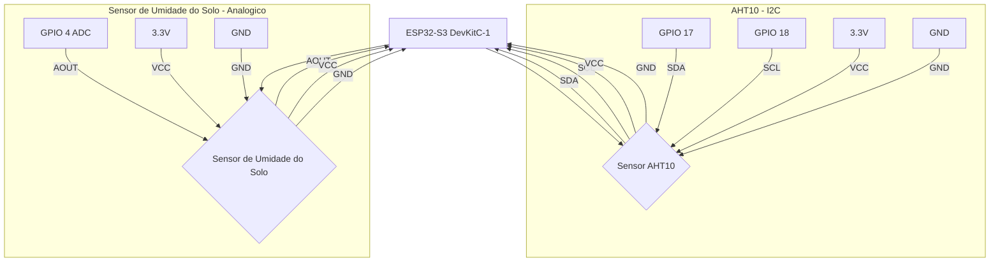

# Guardiões da Floresta — Sistema IoT de Monitoramento Ambiental

Sistema de monitoramento ambiental em tempo real desenvolvido para apoiar a agricultura familiar local. O projeto utiliza sensores de baixo custo conectados a um microcontrolador ESP32 para coletar dados de temperatura, umidade do ar e umidade do solo, transmitindo essas informações a um servidor local que processa, armazena e exibe os dados em um dashboard interativo — **sem depender de internet**.

A proposta é oferecer ao pequeno agricultor uma ferramenta acessível e confiável para acompanhar as condições do ambiente de cultivo em tempo real, auxiliando na tomada de decisões sobre irrigação, ventilação e manejo da plantação.

---

## Releases / Versões

As versões são publicadas de forma **independente**, cada uma com seu próprio instalador e documentação:

| Versão | Status | Tag / Branch | Instalação |
| :--- | :--- | :--- | :--- |
| **v1.0** | Estável | `v1.0.0` / `release/v1` | `curl -fsSL .../v1.0.0/install.sh \| bash` |
| **v2.0** (este documento) | Beta | `v2.0.0-beta.1` / `main` | `curl -fsSL .../v2.0.0-beta.1/install.sh \| bash` |

> A v1.0 (estável) continua **100% funcional** e é instalada sem nenhum código
> da v2. No `main`, os arquivos legados da v1 ficam em `legacy/` apenas como
> referência — o código canônico da v1 vive na branch `release/v1` (tag `v1.0.0`).

---

## v2.0 — Beta

A **v2.0** evolui o sistema para uma arquitetura **MQTT-first**, na qual todo transporte (serial e Wi-Fi) passa primeiro pelo broker MQTT e um único serviço (`ingest_service`) normaliza e grava os dados.

**Status:** O sistema está em fase de testes e validação em campo.

---

## Instalação Rápida — Um Único Comando

Instale todo o sistema Guardiões da Floresta IoT v2.0 automaticamente com:

```bash
curl -fsSL https://raw.githubusercontent.com/Alfos-dev/guardioes-da-floresta-iot/v2.0.0-beta.1/install.sh | bash
```

**O instalador faz tudo automaticamente:**
- Detecta e instala Docker/Docker Compose (se necessário)
- Baixa o código do projeto (release `v2.0.0-beta.1`)
- Gera credenciais seguras aleatórias (`./.env`)
- Gera o arquivo de senha do Mosquitto
- Configura e inicia os **7 serviços**

**Após a instalação, acesse:**
- **Painel de Administração:** `http://IP_DO_SERVIDOR:8000`
- **Grafana:** `http://IP_DO_SERVIDOR:3000`

Para instalação manual ou troubleshooting, consulte [`INSTALL.md`](INSTALL.md).

---

## O que está sendo entregue

| Componente | Local | Descrição |
| :--- | :--- | :--- |
| **Firmware v2** | `firmware-v2/` | Projeto PlatformIO para ESP32-S3 e ESP32 DOIT, modular em 3 camadas (config NVS / sensores / transporte MQTT), com provisionamento via portal cativo |
| **Broker MQTT** | `services/mosquitto/` | Mosquitto 2.x com autenticação usuário/senha e mensagens retained |
| **ingest_service** | `services/ingest_service/` | Assina `guardioes/+/telemetry` e `guardioes/+/status`, valida o schema genérico, grava no InfluxDB e mantém o registro de dispositivos no SQLite (auto-discovery) |
| **serial_bridge** | `bridge/` | Converte a serial em schema genérico e **publica no MQTT** (mantém compatibilidade com o payload v1) |
| **Painel de Administração** | `admin_panel/` | Web (FastAPI + HTML/CSS/JS) para gerenciar dispositivos, editar calibração em tempo real via MQTT, visualizar dados históricos, **construtor de firmware customizado** (Fase 4), **dashboard em tempo real** (Fase 5) e **gravação de firmware via USB** (Fase 6) |
| **moon_service** | `moon/` | Fase da lua em tempo real (via `ephem`) gravada no InfluxDB |

---

## Nova arquitetura (v2.0)

```
ESP32-S3 (USB) --serial--> serial_bridge --+
                                             +--> Mosquitto (MQTT) --> ingest_service --+--> InfluxDB --> Grafana
ESP32 / ESP32-S3 (Wi-Fi) ------MQTT---------+                                          +--> SQLite (registro de dispositivos)
```

**Fluxo de dados:**
1. **Coleta**: o firmware a cada intervalo publica telemetria no MQTT (Wi-Fi) ou via serial (USB).
2. **Transporte**: `serial_bridge` repassa serial → MQTT; sensores Wi-Fi publicam direto no broker.
3. **Ingestão**: `ingest_service` valida o schema, grava cada leitura no InfluxDB e registra o dispositivo no SQLite (auto-discovery).
4. **Visualização**: Grafana e Painel de Administração consomem os dados localmente.

---

## Esquema genérico de telemetria

```json
{
  "device_id": "esp32s3_01",
  "timestamp": "2026-07-30T14:00:00Z",
  "readings": [
    { "sensor": "soil_moisture", "value": 42,   "unit": "%" },
    { "sensor": "air_temp",      "value": 27.4, "unit": "C" }
  ]
}
```

O backend não precisa conhecer um sensor com antecedência: qualquer leitura com
`sensor`/`value`/`unit` é ingerida sem mudança de código.

---

## Tópicos MQTT

| Tópico | Direção | Descrição |
| :--- | :--- | :--- |
| `guardioes/{device_id}/telemetry` | dispositivo → servidor | Telemetria (QoS 1) |
| `guardioes/{device_id}/config` | servidor → dispositivo | Configuração/calibração (retained, QoS 1) |
| `guardioes/{device_id}/status` | dispositivo → servidor | Heartbeat `{"online": true}` a cada 30s |

---

## Painel de Administração

Interface web (FastAPI) com autenticação JWT em `http://IP_DO_SERVIDOR:8000`.

- **Dispositivos**: CRUD completo + auto-discovery vindo do SQLite.
- **Calibração em tempo real**: edita `soil_dry`/`soil_wet`/`publish_interval` e publica via MQTT retained — sem regravar o firmware.
- **Dados históricos**: leituras via InfluxDB (últimas e histórico agregado).
- **Construtor de firmware (Fase 4)**: seleciona placa e sensores do catálogo e compila um firmware customizado (`.bin` para download).
- **Dashboard (Fase 5)**: gráficos em tempo real com Chart.js e auto-refresh.
- **Gravação via USB (Fase 6)**: lista portas seriais do servidor e grava o firmware compilado direto no ESP32 com `esptool`.

---

## Instalação Manual

Para instalação manual ou configurações avançadas, consulte [`INSTALL.md`](INSTALL.md).

**Passos básicos:**

```bash
cp .env.example .env          # defina MQTT_USER / MQTT_PASS e tokens
# gera o arquivo de senha do Mosquitto a partir das credenciais do .env
MQTT_USER=guardioes MQTT_PASS="sua-senha" bash services/mosquitto/gen-passwd.sh
docker compose up -d --build  # sobe influxdb, grafana, mosquitto, ingest_service,
                              # serial_bridge, moon_service e admin_panel
```

---

## Compilar/gravar o firmware v2 (offline)

```bash
cd firmware-v2
pio run -e esp32s3_v2            # compila para ESP32-S3
pio run -e esp32_doit_v2         # compila para ESP32 DOIT DevKit V1
pio run -e esp32s3_v2 -t upload  # grava no ESP32-S3
```

> Na primeira inicialização com a NVS vazia, o dispositivo sobe um Wi-Fi
> `Guardioes-Setup` (192.168.4.1) com um portal para configurar Wi-Fi, broker
> MQTT e `device_id`.

---

## Hardware e Conexões

Para replicar o projeto, utilize os componentes e conexões detalhados abaixo.

### Lista de Materiais (BOM)

| Componente | Quantidade | Observações |
| :--- | :--- | :--- |
| ESP32-S3 DevKitC-1 (ou ESP32 DOIT) | 1 | Microcontrolador principal |
| Sensor AHT10 | 1 | Sensor de Temp e Umidade do Ar |
| Sensor Capacitivo de Solo | 1 | Medição de umidade do solo sem corrosão |
| Cabo USB-C | 1 | Alimentação e dados serial |
| Mini PC ou Raspberry Pi | 1 | Servidor para rodar o Docker |
| Roteador Wi-Fi | 1 | Para criar a rede local |

### Diagrama de Conexões (ESP32-S3)



**Tabela de Pinagem:**

| Sensor | Pino do Sensor | Pino do ESP32-S3 | Função |
| :--- | :--- | :--- | :--- |
| AHT10 | VCC | 3.3V | Alimentação |
| AHT10 | GND | GND | Terra |
| AHT10 | SDA | GPIO 17 | Dados I2C |
| AHT10 | SCL | GPIO 18 | Clock I2C |
| Solo | VCC | 3.3V | Alimentação |
| Solo | GND | GND | Terra |
| Solo | AOUT | GPIO 4 | Saída Analógica |

---

## Tecnologias Utilizadas

| Camada | Tecnologia | Descrição |
| :--- | :--- | :--- |
| **Hardware** | ESP32-S3 / ESP32 DOIT | Microcontrolador do nó sensor |
| **Hardware** | AHT10 | Sensor de temperatura e umidade do ar |
| **Hardware** | Sensor Capacitivo | Medição de umidade do solo sem corrosão |
| **Firmware** | C++ PlatformIO | Firmware modular v2 (NVS + sensores + MQTT) |
| **Transporte** | Mosquitto 2.x (MQTT) | Broker com autenticação e mensagens retained |
| **Ingestão** | Python 3 (`ingest_service`) | Valida schema, grava no InfluxDB e registra dispositivos no SQLite |
| **Ponte Serial** | Python 3 (`serial_bridge`) | Serial → MQTT (compatível com payload v1) |
| **Painel** | FastAPI + SQLite + Chart.js | Admin panel, calibração, builder de firmware e dashboard |
| **Serviço Lunar** | Python 3 (ephem) | Fase da lua em tempo real |
| **Banco de Dados** | InfluxDB 2.7 | Série temporal das leituras |
| **Visualização** | Grafana | Dashboards interativos |
| **Infraestrutura** | Docker Compose | Orquestração dos 7 serviços |
| **Rede** | Wi-Fi Local | Rede isolada, funcionamento offline |

---

## Funcionamento Offline

- Rede local isolada via Wi-Fi.
- Sem dependência de nuvem ou internet externa.
- Privacidade total dos dados do agricultor.
- Resiliência a quedas de energia com reinicialização automática.

---

## v1.0 — Estável (referência)

A **v1.0** usa a arquitetura original (mais simples): o firmware envia JSON via
**serial USB** e o `serial_bridge` grava direto no InfluxDB, sem MQTT.

- **Instalação:** `curl -fsSL https://raw.githubusercontent.com/Alfos-dev/guardioes-da-floresta-iot/v1.0.0/install.sh | bash`
- **Release:** [`v1.0.0`](https://github.com/Alfos-dev/guardioes-da-floresta-iot/releases/tag/v1.0.0)
- **Branch de manutenção:** `release/v1`
- **Código no `main`:** `legacy/`

---

## Equipe

- Alessandro Vinicius Torres Do Couto
- Ana Clara Flores Monteiro
- André Gustavo Osorio Bezerra
- André Luiz Falcão Otaviano da Silva
- Andrew Soares Teixeira
- Caio Maxwel Silva Moraes
- Davi Cruz Da Costa
- Douglas Almeida Menezes De Oliveira
- Emerson Henrique Soeiro Cutrim
- Erick Martins De Carvalho
- Frank Ryan Da Silva Braga
- Gabriel Benoliel Malcher
- Gracieide Guimaraes Barbosa
- Janff Henrique Guedes De Souza
- João Pedro Marques Nascimento
- João Vitor Pereira Dos Santos
- João Luiz Carneiro Chistama
- Kevyn Willian Oliveira Da Silva
- Lucas Vasques Dos Santos
- Luiz Cristiano Ferreira de Oliveira
- Luiz Eduardo Custodio Duarte
- Luiz Gustavo De Souza Feitosa
- Perter Jofre Ribeiro Jati Junior
- Richard Oliver Cabral Melo
- Talyson Alves

---

## Licença

Este projeto é livre para uso acadêmico e educacional, desenvolvido como iniciativa de apoio à agricultura local.