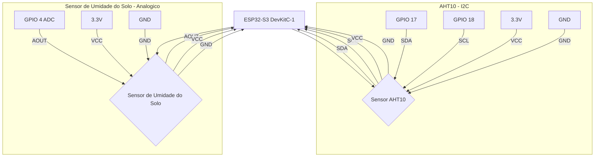

# Guardiões da Floresta — Sistema IoT de Monitoramento Ambiental

Sistema de monitoramento ambiental em tempo real desenvolvido para apoiar a agricultura familiar local. O projeto utiliza sensores de baixo custo conectados a um microcontrolador ESP32 para coletar dados de temperatura, umidade do ar e umidade do solo, transmitindo essas informações a um servidor local que processa, armazena e exibe os dados em um dashboard interativo — sem depender de internet.

A proposta é oferecer ao pequeno agricultor uma ferramenta acessível e confiável para acompanhar as condições do ambiente de cultivo em tempo real, auxiliando na tomada de decisões sobre irrigação, ventilação e manejo da plantação.

---

## 1. Arquitetura do Sistema

O sistema **Guardiões da Floresta** opera de forma autônoma e local, garantindo o monitoramento contínuo das condições ambientais sem a necessidade de conexão com a internet. A arquitetura é modular e baseada em contêineres Docker, facilitando a implantação e o gerenciamento.

```
+-------------------------------------------------------------+
|                     ESP32 (Nó Sensor)                       |
|  AHT10 (Temp + Umidade do Ar) + Sensor Capacitivo de Solo  |
|                 Envia JSON via Serial USB                   |
+-------------------------+-----------------------------------+
                          | USB Serial
+-------------------------v-----------------------------------+
|                   Servidor (Mini PC)                        |
|  +----------------+   +--------------+   +-------------+   |
|  | serial_bridge  |-->|   InfluxDB   |-->|   Grafana   |   |
|  |   (Python)     |   |  (banco de   |   | (dashboard) |   |
|  +----------------+   |    dados)    |   +-------------+   |
|  +----------------+   +--------------+                     |
|  | moon_service   |-->  fase da lua em tempo real           |
|  |   (Python)     |                                        |
|  +----------------+                                        |
|        Tudo containerizado com Docker Compose              |
+-------------------------+-----------------------------------+
                          | Wi-Fi Local (sem internet)
+-------------------------v-----------------------------------+
|             Notebook / Celular (Visualização)               |
|             http://IP_DO_SERVIDOR:3000                      |
+-------------------------------------------------------------+
```

**Fluxo de Dados:**
1.  **Coleta**: O microcontrolador ESP32-S3 coleta dados ambientais dos sensores AHT10 e de solo.
2.  **Transmissão**: Os dados são formatados em JSON e enviados via Serial USB para o servidor.
3.  **Processamento**: O script `serial_to_influx.py` lê a serial e armazena os dados no InfluxDB.
4.  **Serviço Lunar**: O script `moon_from_json.py` insere as fases da lua no InfluxDB.
5.  **Visualização**: O Grafana consome os dados do InfluxDB e os exibe no dashboard via Wi-Fi local.

---

## 2. Tecnologias Utilizadas

Este projeto integra diversas tecnologias para criar uma solução robusta e de baixo custo:

| Camada | Tecnologia | Descrição |
| :--- | :--- | :--- |
| **Hardware** | ESP32-S3 DevKitC-1 | Microcontrolador principal do nó sensor |
| **Hardware** | AHT10 | Sensor de temperatura e umidade do ar |
| **Hardware** | Sensor Capacitivo | Medição de umidade do solo sem corrosão |
| **Firmware** | C++ PlatformIO | Código embarcado para leitura e envio serial |
| **Bridge Serial** | Python 3 | Script serial_to_influx para ponte de dados |
| **Serviço Lunar** | Python 3 | Script moon_from_json para dados lunares |
| **Banco de Dados** | InfluxDB 2.7 | Armazenamento de séries temporais |
| **Visualização** | Grafana | Dashboard interativo para visualização |
| **Infraestrutura** | Docker Compose | Orquestração de serviços em contêineres |
| **Rede** | Wi-Fi Local | Rede isolada para acesso offline |

---

## 3. Hardware e Conexões

Para replicar o projeto, utilize os componentes e conexões detalhados abaixo.

### Lista de Materiais (BOM)

| Componente | Quantidade | Observações |
| :--- | :--- | :--- |
| ESP32-S3 DevKitC-1 | 1 | Microcontrolador principal |
| Sensor AHT10 | 1 | Sensor de Temp e Umidade |
| Sensor Capacitivo de Solo | 1 | Sensor de umidade do solo |
| Cabo USB-C | 1 | Alimentação e dados serial |
| Mini PC ou Raspberry Pi | 1 | Servidor para rodar o Docker |
| Roteador Wi-Fi | 1 | Para criar a rede local |

### Diagrama de Conexões (ESP32-S3)



**Tabela de Pinagem:**

| Sensor | Pino do Sensor | Pino do ESP32-S3 | Função |
| :--- | :--- | :--- | :--- |
| AHT10 | VCC | 3.3V | Alimentação |
| AHT10 | GND | GND | Terra |
| AHT10 | SDA | GPIO 17 | Dados I2C |
| AHT10 | SCL | GPIO 18 | Clock I2C |
| Solo | VCC | 3.3V | Alimentação |
| Solo | GND | GND | Terra |
| Solo | AOUT | GPIO 4 | Saída Analógica |

---

## 4. Configuração do Ambiente (Servidor)

### Pré-requisitos
*   Linux (Debian ou Ubuntu recomendado)
*   Docker e Docker Compose instalados
*   ESP32 conectado via USB ao servidor

### Passos de Instalação

1.  **Clone o Repositório:**
    ```bash
    git clone https://github.com/Alfos-dev/guardioes-da-floresta-iot.git
    cd guardioes-da-floresta-iot
    ```

2.  **Configure as Variáveis de Ambiente:**
    Crie o arquivo `.env` e edite com suas credenciais.
    ```bash
    cp .env.example .env
    nano .env
    ```

3.  **Suba os Contêineres Docker:**
    ```bash
    docker compose up -d --build
    ```

---

## 5. Firmware ESP32

O firmware é desenvolvido no PlatformIO.

1.  **Abra a pasta `src/`** no VS Code com a extensão PlatformIO.
2.  **Compile e faça o Upload** para o ESP32 conectado.
3.  **Monitore a Serial** (115200 baud) para verificar o envio do JSON.

---

## 6. Scripts de Integração Python

*   **serial_to_influx.py**: Lê a porta serial (ex: `/dev/ttyUSB0`) e envia os dados para o InfluxDB.
*   **moon_from_json.py**: Consulta o `calendario_lunar_2026.json` e envia a fase da lua atual para o InfluxDB a cada minuto.

---

## 7. Dados e Queries Flux

Os dados são armazenados no bucket `monitoramento`.

### Estrutura no InfluxDB
*   **sensor_data**: Campos `t` (Temp), `ha` (Umidade Ar), `s` (Umidade Solo), `soil_raw` (ADC Bruto).
*   **moon_data**: Campo `phase` (Fase da Lua).

### Exemplos de Queries (Grafana)
*   **Última Umidade do Solo**:
    ```flux
    from(bucket: "monitoramento") |> range(start: -5m) |> filter(fn: (r) => r._measurement == "sensor_data" and r._field == "s") |> last()
    ```
*   **Fase da Lua Atual**:
    ```flux
    from(bucket: "monitoramento") |> range(start: -24h) |> filter(fn: (r) => r._measurement == "moon_data" and r._field == "phase") |> last()
    ```

---

## 8. Funcionamento Offline

*   Rede local isolada via Wi-Fi.
*   Sem dependência de nuvem ou internet externa.
*   Privacidade total dos dados do agricultor.
*   Resiliência a quedas de energia com reinicialização automática.

---

## 9. Equipe

*   Alessandro Vinicius Torres Do Couto
*   Ana Clara Flores Monteiro
*   André Gustavo Osorio Bezerra
*   André Luiz Falcão Otaviano da Silva
*   Andrew Soares Teixeira
*   Caio Maxwel Silva Moraes
*   Davi Cruz Da Costa
*   Douglas Almeida Menezes De Oliveira
*   Emerson Henrique Soeiro Cutrim
*   Erick Martins De Carvalho
*   Frank Ryan Da Silva Braga
*   Gabriel Benoliel Malcher
*   Gracieide Guimaraes Barbosa
*   Janff Henrique Guedes De Souza
*   João Pedro Marques Nascimento
*   João Vitor Pereira Dos Santos
*   João Luiz Carneiro Chistama
*   Kevyn Willian Oliveira Da Silva
*   Lucas Vasques Dos Santos
*   Luiz Cristiano Ferreira de Oliveira
*   Luiz Eduardo Custodio Duarte
*   Luiz Gustavo De Souza Feitosa
*   Perter Jofre Ribeiro Jati Junior
*   Richard Oliver Cabral Melo
*   Talyson Alves

---

## 10. Licença

Este projeto é livre para uso acadêmico e educacional, desenvolvido como iniciativa de apoio à agricultura local.

---
