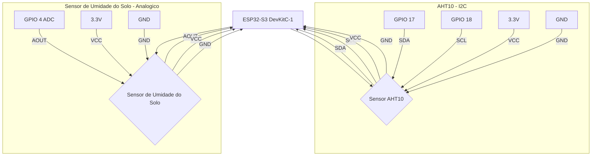

# Guardiões da Floresta — Sistema IoT de Monitoramento Ambiental

Sistema de monitoramento ambiental em tempo real desenvolvido para apoiar a agricultura familiar local. O projeto utiliza sensores de baixo custo conectados a um microcontrolador ESP32 para coletar dados de temperatura, umidade do ar e umidade do solo, transmitindo essas informações a um servidor local que processa, armazena e exibe os dados em um dashboard interativo — sem depender de internet.

A proposta é oferecer ao pequeno agricultor uma ferramenta acessível e confiável para acompanhar as condições do ambiente de cultivo em tempo real, auxiliando na tomada de decisões sobre irrigação, ventilação e manejo da plantação.

---

## Releases / Versões

As versões são publicadas de forma **independente**, cada uma com seu próprio
instalador e documentação:

| Versão | Status | Tag / Branch | Instalação |
| :--- | :--- | :--- | :--- |
| **v1.0** | Estável | `v1.0.0` / `release/v1` | `curl -fsSL .../v1.0.0/install.sh \| bash` |
| **v2.0** (este documento) | Beta | `v2.0.0-beta.1` / `main` | `curl -fsSL .../v2.0.0-beta.1/install.sh \| bash` |

> A v1.0 (estável) continua **100% funcional** e é instalada sem nenhum código
> da v2. Os arquivos legados da v1 foram movidos para `legacy/` apenas como
> referência — o código canônico da v1 vive na branch `release/v1`.

---

## v2.0 — BETA

A **v2.0** evolui o sistema para uma arquitetura **MQTT-first**, na qual todo transporte (serial e Wi-Fi) passa primeiro pelo broker MQTT e um único serviço (`ingest_service`) normaliza e grava os dados. 

**Status:** O sistema está em fase de testes e validação em campo.

---

## Instalação Rápida — Um Único Comando

Instale todo o sistema Guardiões da Floresta IoT v2.0 automaticamente com:

```bash
curl -fsSL https://raw.githubusercontent.com/Alfos-dev/guardioes-da-floresta-iot/v2.0.0-beta.1/install.sh | bash
```

**O instalador faz tudo automaticamente:**
- Detecta e instala Docker/Docker Compose (se necessário)
- Baixa o código do projeto
- Gera credenciais seguras aleatórias
- Configura todos os 7 serviços
- Inicia o sistema completo

**Após a instalação, acesse:**
- **Painel de Administração:** `http://IP_DO_SERVIDOR:8000`
- **Grafana:** `http://IP_DO_SERVIDOR:3000`

Para instalação manual ou troubleshooting, consulte [`INSTALL.md`](INSTALL.md).

---

### O que está sendo entregue

| Componente | Local | Descrição |
| :--- | :--- | :--- |
| **Firmware v2** | `firmware-v2/` | Projeto PlatformIO para ESP32-S3 e ESP32, modular em 3 camadas (config NVS / sensores / transporte MQTT), com provisionamento via portal cativo |
| **Broker MQTT** | `services/mosquitto/` | Mosquitto 2.x com autenticação usuário/senha e mensagens retained |
| **ingest_service** | `services/ingest_service/` | Assina `guardioes/+/telemetry` e `guardioes/+/status`, valida o schema genérico, grava no InfluxDB e mantém o registro de dispositivos no SQLite (auto-discovery) |
| **serial_bridge (atualizado)** | `bridge/` | Deixou de escrever no InfluxDB; agora converte a serial para o schema genérico e **publica no MQTT** (mantém compatibilidade com o payload v1) |
| **Painel de Administração** | `admin_panel/` | Interface web (FastAPI + HTML/CSS/JS) para gerenciar dispositivos, editar calibração em tempo real via MQTT, visualizar dados históricos, **construtor de firmware customizado** (Fase 4), **dashboard de dados em tempo real** com gráficos e auto-refresh (Fase 5) e **gravação de firmware no ESP32 via servidor/USB** (Fase 6) |

### Nova arquitetura (v2.0)

```
ESP32-S3 (USB) --serial--> serial_bridge --+
                                            +--> Mosquitto (MQTT) --> ingest_service --+--> InfluxDB --> Grafana
ESP32/ESP8266 (Wi-Fi) -----MQTT------------+                                          +--> SQLite (registro de dispositivos)
```

### Esquema genérico de telemetria

```json
{
  "device_id": "esp32s3_01",
  "timestamp": "2026-07-30T14:00:00Z",
  "readings": [
    { "sensor": "soil_moisture", "value": 42,   "unit": "%" },
    { "sensor": "air_temp",      "value": 27.4, "unit": "C" }
  ]
}
```

### Tópicos MQTT

| Tópico | Direção | Descrição |
| :--- | :--- | :--- |
| `guardioes/{device_id}/telemetry` | dispositivo → servidor | Telemetria (QoS 1) |
| `guardioes/{device_id}/config` | servidor → dispositivo | Configuração/calibração (retained, QoS 1) |
| `guardioes/{device_id}/status` | dispositivo → servidor | Heartbeat `{"online": true}` a cada 30s |

### Instalação Manual (alternativa ao instalador automático)

Para instalação manual ou configurações avançadas, consulte [`INSTALL.md`](INSTALL.md).

**Passos básicos:**

```bash
cp .env.example .env          # defina MQTT_USER / MQTT_PASS e tokens
# gera o arquivo de senha do Mosquitto a partir das credenciais do .env
MQTT_USER=guardioes MQTT_PASS="sua-senha" bash services/mosquitto/gen-passwd.sh
docker compose up -d --build  # sobe influxdb, grafana, mosquitto, ingest_service, serial_bridge, moon_service
```

### Compilar/gravar o firmware v2 (offline)

```bash
cd firmware-v2
pio run -e esp32s3_v2            # compila (offline após o primeiro cache de libs)
pio run -e esp32s3_v2 -t upload  # grava no ESP32-S3
```

> Na primeira inicialização com a NVS vazia, o dispositivo sobe um Wi-Fi `Guardioes-Setup` (192.168.4.1) com um portal para configurar Wi-Fi, broker MQTT e `device_id`.

---

## 1. Arquitetura do Sistema (v1.0)

> As seções 1–8 abaixo documentam a **v1.0 (estável)**, mantidas aqui como
> referência de hardware e conceitos. Para instalar e documentar a v1, use a
> release [`v1.0.0`](https://github.com/Alfos-dev/guardioes-da-floresta-iot/releases/tag/v1.0.0)
> (branch `release/v1`). O código da v1 está em `legacy/`.

O sistema **Guardiões da Floresta** opera de forma autônoma e local, garantindo o monitoramento contínuo das condições ambientais sem a necessidade de conexão com a internet. A arquitetura é modular e baseada em contêineres Docker, facilitando a implantação e o gerenciamento.

```
+-------------------------------------------------------------+
|                     ESP32 (Nó Sensor)                       |
|  AHT10 (Temp + Umidade do Ar) + Sensor Capacitivo de Solo  |
|                 Envia JSON via Serial USB                   |
+-------------------------+-----------------------------------+
                          | USB Serial
+-------------------------v-----------------------------------+
|                   Servidor (Mini PC)                        |
|  +----------------+   +--------------+   +-------------+   |
|  | serial_bridge  |-->|   InfluxDB   |-->|   Grafana   |   |
|  |   (Python)     |   |  (banco de   |   | (dashboard) |   |
|  +----------------+   |    dados)    |   +-------------+   |
|  +----------------+   +--------------+                     |
|  | moon_service   |-->  fase da lua em tempo real           |
|  |   (Python)     |                                        |
|  +----------------+                                        |
|        Tudo containerizado com Docker Compose              |
+-------------------------+-----------------------------------+
                          | Wi-Fi Local (sem internet)
+-------------------------v-----------------------------------+
|             Notebook / Celular (Visualização)               |
|             http://IP_DO_SERVIDOR:3000                      |
+-------------------------------------------------------------+
```

**Fluxo de Dados:**
1.  **Coleta**: O microcontrolador ESP32-S3 coleta dados ambientais dos sensores AHT10 e de solo.
2.  **Transmissão**: Os dados são formatados em JSON e enviados via Serial USB para o servidor.
3.  **Processamento**: O script `bridge/serial_bridge.py` lê a serial e armazena os dados no InfluxDB.
4.  **Serviço Lunar**: O script `moon/moon_service.py` calcula a fase da lua em tempo real e a insere no InfluxDB.
5.  **Visualização**: O Grafana consome os dados do InfluxDB e os exibe no dashboard via Wi-Fi local.

---

## 2. Tecnologias Utilizadas

Este projeto integra diversas tecnologias para criar uma solução robusta e de baixo custo:

| Camada | Tecnologia | Descrição |
| :--- | :--- | :--- |
| **Hardware** | ESP32-S3 DevKitC-1 | Microcontrolador principal do nó sensor |
| **Hardware** | AHT10 | Sensor de temperatura e umidade do ar |
| **Hardware** | Sensor Capacitivo | Medição de umidade do solo sem corrosão |
| **Firmware** | C++ PlatformIO | Código embarcado para leitura e envio serial |
| **Bridge Serial** | Python 3 | Script `bridge/serial_bridge.py` para ponte de dados |
| **Serviço Lunar** | Python 3 (ephem) | Script `moon/moon_service.py` para cálculo da fase lunar |
| **Banco de Dados** | InfluxDB 2.7 | Armazenamento de séries temporais |
| **Visualização** | Grafana | Dashboard interativo para visualização |
| **Infraestrutura** | Docker Compose | Orquestração de serviços em contêineres |
| **Rede** | Wi-Fi Local | Rede isolada para acesso offline |

---

## 3. Hardware e Conexões

Para replicar o projeto, utilize os componentes e conexões detalhados abaixo.

### Lista de Materiais (BOM)

| Componente | Quantidade | Observações |
| :--- | :--- | :--- |
| ESP32-S3 DevKitC-1 | 1 | Microcontrolador principal |
| Sensor AHT10 | 1 | Sensor de Temp e Umidade |
| Sensor Capacitivo de Solo | 1 | Sensor de umidade do solo |
| Cabo USB-C | 1 | Alimentação e dados serial |
| Mini PC ou Raspberry Pi | 1 | Servidor para rodar o Docker |
| Roteador Wi-Fi | 1 | Para criar a rede local |

### Diagrama de Conexões (ESP32-S3)



**Tabela de Pinagem:**

| Sensor | Pino do Sensor | Pino do ESP32-S3 | Função |
| :--- | :--- | :--- | :--- |
| AHT10 | VCC | 3.3V | Alimentação |
| AHT10 | GND | GND | Terra |
| AHT10 | SDA | GPIO 17 | Dados I2C |
| AHT10 | SCL | GPIO 18 | Clock I2C |
| Solo | VCC | 3.3V | Alimentação |
| Solo | GND | GND | Terra |
| Solo | AOUT | GPIO 4 | Saída Analógica |

---

## 4. Configuração do Ambiente (Servidor)

### Pré-requisitos
*   Linux (Debian ou Ubuntu recomendado)
*   Docker e Docker Compose instalados
*   ESP32 conectado via USB ao servidor

### Passos de Instalação

1.  **Clone o Repositório (release v1.0.0):**
    ```bash
    git clone --branch v1.0.0 --depth 1 https://github.com/Alfos-dev/guardioes-da-floresta-iot.git
    cd guardioes-da-floresta-iot
    ```

2.  **Configure as Variáveis de Ambiente:**
    Crie o arquivo `.env` e edite com suas credenciais.
    ```bash
    cp .env.example .env
    nano .env
    ```

3.  **Suba os Contêineres Docker:**
    ```bash
    docker compose up -d --build
    ```

---

## 5. Firmware ESP32

O firmware v1 é desenvolvido no PlatformIO (pasta `legacy/` no `main`, ou `src/`
+ `platformio.ini` na release `v1.0.0`).

1.  **Abra a pasta `legacy/`** no VS Code com a extensão PlatformIO.
2.  **Compile e faça o Upload** para o ESP32 conectado.
3.  **Monitore a Serial** (115200 baud) para verificar o envio do JSON.

---

## 6. Scripts de Integração Python

*   **bridge/serial_bridge.py**: Lê a porta serial (ex: `/dev/ttyUSB0`) e envia os dados para o InfluxDB.
*   **moon/moon_service.py**: Calcula a fase da lua atual em tempo real (via biblioteca `ephem`) e envia o resultado para o InfluxDB a cada hora.

---

## 7. Dados e Queries Flux

Os dados são armazenados no bucket `monitoramento`.

### Estrutura no InfluxDB
*   **sensor_data**: Campos `t` (Temp), `ha` (Umidade Ar), `s` (Umidade Solo), `soil_raw` (ADC Bruto).
*   **moon_data**: Campos `phase` (Fase da Lua), `illumination` (% de Iluminação) e `age_days` (Idade da Lua em dias); tag `location`.

### Exemplos de Queries (Grafana)
*   **Última Umidade do Solo**:
    ```flux
    from(bucket: "monitoramento") |> range(start: -5m) |> filter(fn: (r) => r._measurement == "sensor_data" and r._field == "s") |> last()
    ```
*   **Fase da Lua Atual**:
    ```flux
    from(bucket: "monitoramento") |> range(start: -24h) |> filter(fn: (r) => r._measurement == "moon_data" and r._field == "phase") |> last()
    ```

---

## 8. Funcionamento Offline

*   Rede local isolada via Wi-Fi.
*   Sem dependência de nuvem ou internet externa.
*   Privacidade total dos dados do agricultor.
*   Resiliência a quedas de energia com reinicialização automática.

---

## 9. Equipe

*   Alessandro Vinicius Torres Do Couto
*   Ana Clara Flores Monteiro
*   André Gustavo Osorio Bezerra
*   André Luiz Falcão Otaviano da Silva
*   Andrew Soares Teixeira
*   Caio Maxwel Silva Moraes
*   Davi Cruz Da Costa
*   Douglas Almeida Menezes De Oliveira
*   Emerson Henrique Soeiro Cutrim
*   Erick Martins De Carvalho
*   Frank Ryan Da Silva Braga
*   Gabriel Benoliel Malcher
*   Gracieide Guimaraes Barbosa
*   Janff Henrique Guedes De Souza
*   João Pedro Marques Nascimento
*   João Vitor Pereira Dos Santos
*   João Luiz Carneiro Chistama
*   Kevyn Willian Oliveira Da Silva
*   Lucas Vasques Dos Santos
*   Luiz Cristiano Ferreira de Oliveira
*   Luiz Eduardo Custodio Duarte
*   Luiz Gustavo De Souza Feitosa
*   Perter Jofre Ribeiro Jati Junior
*   Richard Oliver Cabral Melo
*   Talyson Alves

---

## 10. Licença

Este projeto é livre para uso acadêmico e educacional, desenvolvido como iniciativa de apoio à agricultura local.

---
